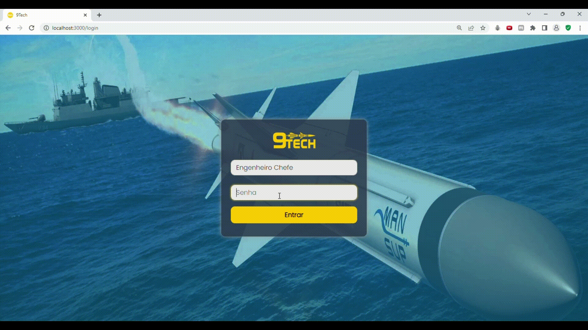
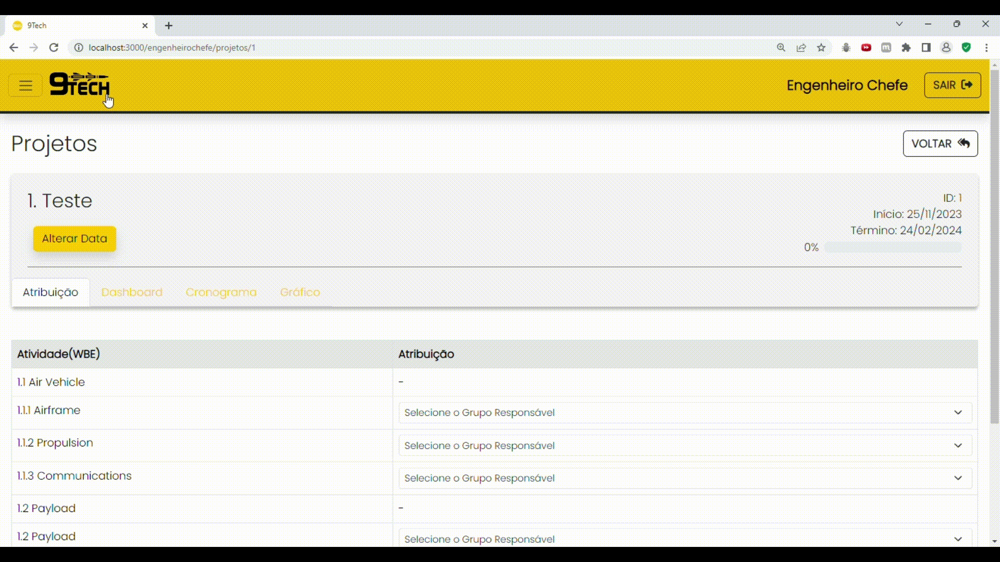
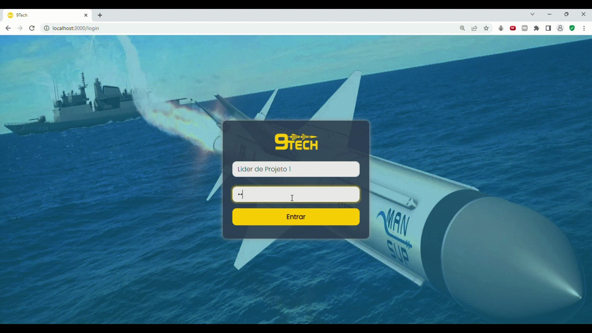

      

<h1 align="center">Sprint 4: 06/11/2023 a 26/11/2023</h1>

<a href="#objetivos">Objetivos da sprint</a> &nbsp |&nbsp &nbsp
<a href="#entregas">Entregas</a> &nbsp |&nbsp &nbsp
 &nbsp
<a href="#links">Links úteis</a>

O projeto visa criar um sistema de gerenciamento de equipes para projetos complexos. Na primeira sprint, focamos na funcionalidade de importação e edição de projetos a partir de arquivos .xlsx. Para isso, validamos requisitos, desenvolvemos um protótipo e construímos interfaces e serviços de alto valor para o cliente. Isso nos permitiu iniciar com uma entrega alinhada às necessidades do cliente e com base sólida para próximas sprints.

## :dart: Objetivos da Sprint

Os requisitos contemplados por esta sprint incluem:

#### Requisitos Funcionais

- **RF 05: Criação, Listagem, Atualização e Exclusão de Líderes de Projeto pelo Engenheiro Chefe**
- **RF 02: Criação de Baseline e Tendência para análise de Tendência de Projeto**
- **RF 01: Saída de Arquivo Excel contendo WBS e Porcentagens**

#### Requisitos Não Funcionais

- **RNF 09: Front-end com Javascript (React)**
- **RNF 10: Backend com JavaScript ou Java (Spring)**

## :heavy_check_mark: Entregas

Durante a conclusão da sprint, obtivemos a aprovação dos elementos essenciais do SCRUM, incluindo o Backlog do Produto, o Backlog das Sprints e as User Stories, por meio de uma comunicação direta estabelecida entre o Product Owner (P.O.) e o cliente.

### RF 05: CRUD de Líderes de Projeto pelo Engenheiro Chefe

Esse requisito permite ao Engenheiro Chefe a Criação, Listagem, Atualização e Exclusão de Líderes de Projeto.

### RF 02: Criação de Baseline e Tendência para análise de Tendência de Projeto

Esse requisito permite ao Líder de Projeto criar uma tendência para a atividade, incluindo atrasá-la ou adiantá-la em relação a Data estipulada como Baseline.

### RF 01: Saída de Arquivo Excel contendo WBS e Porcentagens

Esse requisito permite ao Engenheiro Chefe baixar em arquivo Excel a estrutura WBS do Projeto junto das Porcentagens Reais avançadas para cada um dos itens da estrutura.

#### Usuários do Sistema

- **Usuário Engenheiro Chefe: (senha: 123)** tem em sua página inicial a função de importar um projeto por meio de um arquivo .xlsx ([Arquivo padrão para importação](
 https://easyupload.io/yhlxx6)), os cards dos projetos já importados, podendo visualizar e editar as diferentes partes de um projeto e também atribuir um líder de projeto a um pacote de trabalho.
   
- **Usuário Líder de Projeto: (senha: 123)** tem em sua página inicial os cards dos pacotes de trabalho atribuídos a ele.

## :link: Links úteis

 - **Repositórios**
    - Documentação Completa: [clique aqui](https://github.com/Nine-Tech/nine-tech-documentation)
    - Frontend:[clique aqui](https://github.com/Nine-Tech/nine-tech-front/tree/2719c0b5d8162bfdd900a73e510ae512bb04acf7) 
    - Backend:[clique aqui](https://github.com/Nine-Tech/nine-tech-back/tree/ae78389255aec3bacd31c4cf6c692085983a4334) 
     
  
  - **Modelo do Arquivo para importação:** [Cique aqui](
 https://easyupload.io/yhlxx6)
 
 

<a href="#topo">Voltar ao topo</a>
